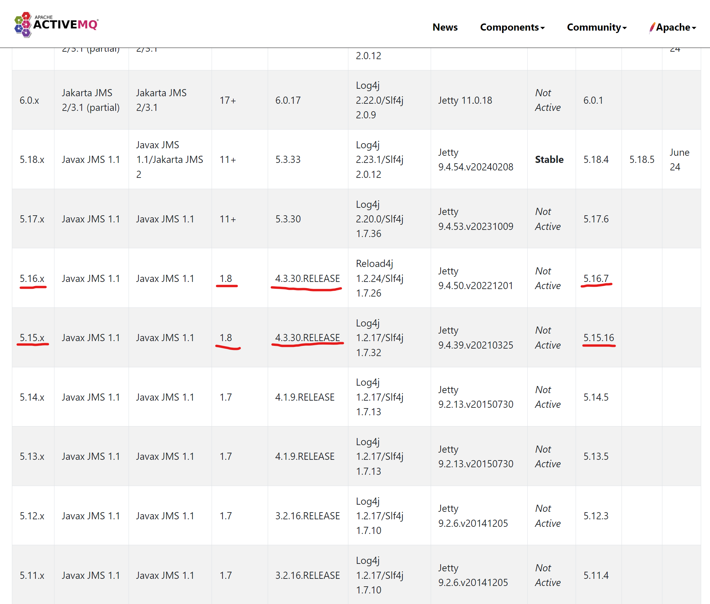

# sand-activemq模块

本模块是[SandFlower](https://github.com/langhua/SandFlower)的组成部分的目标是令ActiveMQ与OFBiz无缝集成，以便在[sand-openapi](https://github.com/langhua/sand-openapi)等模块中使用ActiveMQ消息队列。ActiveMQ以嵌入式（Embedded）方式运行在OFBiz框架中，而不是独立的服务器方式。

### 使用方法

推荐使用idea community来开发sand-activemq模块。步骤如下：

1. 下载和安装idea community
2. 在idea中，从github检出[ofbiz-framework](https://github.com/apache/ofbiz-framework)、[sand-activemq](https://github.com/langhua/sand-activemq)到本地，比如

    1. Windows下：

   ```shell
   D:\git\ofbiz-framework
   D:\git\sand-activemq
   D:\git\ofbiz-plugins
   ```

    2. Linux下：

   ```shell
   ~/git/ofbiz-framework
   ~/git/sand-activemq
   ~/git/ofbiz-plugins
   ```

   说明：[ofbiz-plugins](https://github.com/apache/ofbiz-plugins)选装。


3. 在把sand-activemq目录链接为ofbiz-framework/plugins/sand-activemq
    1. Windows中，以系统管理员身份运行命令行终端：

   ```shell
   C:\Windows\System32>D:
   D:\>cd git\ofbiz-framework
   D:\git\ofbiz-framework>mklink /D plugins ..\ofbiz-plugins
   D:\git\ofbiz-framework>cd plugins
   D:\git\ofbiz-framework\plugins>mklink /D sand-activemq ..\..\sand-activemq
   ```

    2. Linux下：

   ```shell
   ~$cd ~/git/ofbiz-framework
   ~/git/ofbiz-framework$ln -s ../ofbiz-plugins plugins
   ~/git/ofbiz-framework$cd plugins
   ~/git/ofbiz-framework/plugins$ln -s ../../sand-activemq sand-activemq
   ```

<br>

### 开发步骤

1. 选定activemq版本

根据[下载ActiveMQ经典版](https://activemq.apache.org/components/classic/download/)的说明，OFBiz-CAS中的spring是4.3.25.RELEASE，因此，可选5.15.16或5.16.7。

  

2. 检出[activemq源码](https://github.com/apache/activemq)到本地：

   ```shell
   git clone https://github.com/apache/activemq.git
   cd activemq
   git checkout activemq-5.16.7
   ```

3. 把activemq-web-console/src/main/java/下的所有目录和文件，复制到sand-activemq模块的src/main/java/下
4. 把activemq-web-console/src/main/webapp/下的所有目录和文件，复制到sand-activemq模块的webapp/admin/下

<br>

### 参考资料
1. [How do I embed a Broker inside a Connection](https://activemq.apache.org/components/classic/documentation/how-do-i-embed-a-broker-inside-a-connection)
2. [ActiveMQ嵌入Tomcat](https://www.cnblogs.com/yfrs/p/embedActiveMQInTomcat.html)
3. [Download ActiveMQ Classic](https://activemq.apache.org/components/classic/download/)